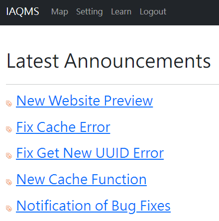
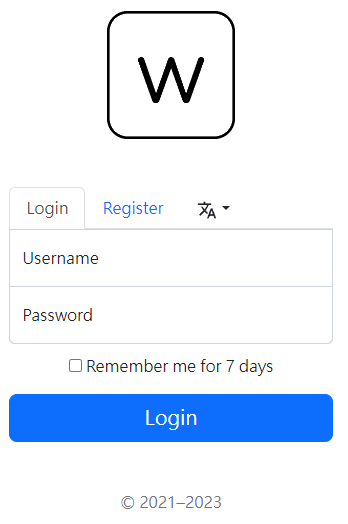
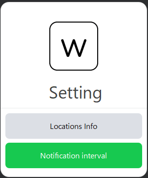
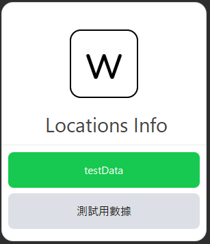
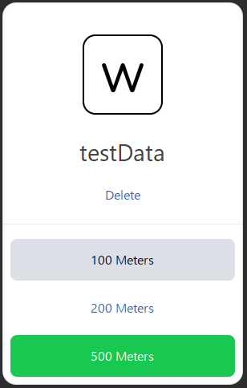
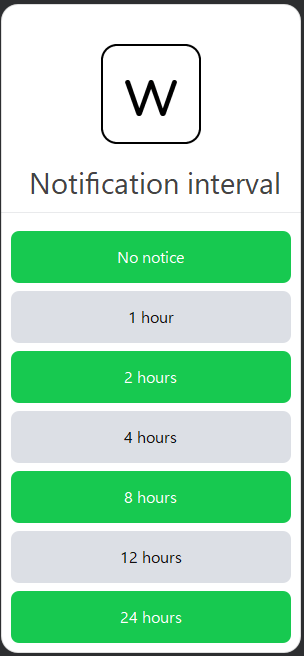
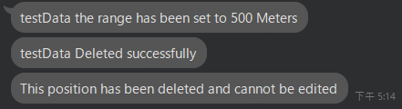
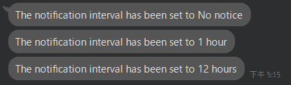

# Intelligent Air Quality Monitoring System v2
English | [繁體中文](README_tw.md)

<a href="https://github.com/wuchieh"></a>
&emsp;
<a href="https://github.com/MeowXiaoXiang"></a>

## Require
```
PostgreSQL
Redis
Nginx
go version > 1.20
```

## Introduction
### This is the second generation of `Intelligent Air Quality Monitoring System`.
### Most of the system has been optimized
### Introduced front-end and back-end separation in the new version
### The front-end uses the Vue3 framework instead of rendering on the back-end to reduce back-end stress
### Also changed the database from MySQL to [PostgreSQL](https://github.com/lib/pq)
### And introduced [Redis](https://github.com/redis/go-redis/) to improve some efficiency and adapt to distributed components
### Changed identity validation to use [JWT](https://github.com/golang-jwt/jwt) for distributed components
### Both front-end and back-end use i18n (international and localized)
### Painting presentation only made a small part of the changes to the main changes are to adapt to the cell phone terminal
<hr>

## Front-end Screen Preview

&emsp;


## Line Screen Preview

&emsp;



&emsp;




