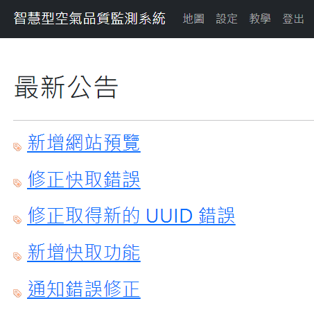
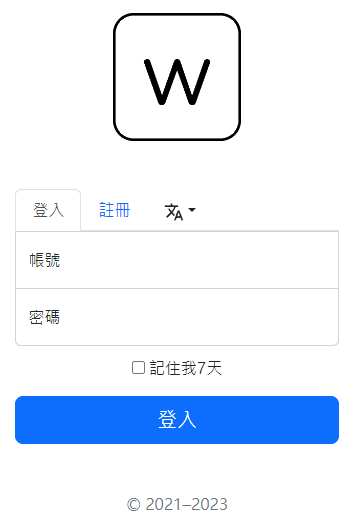
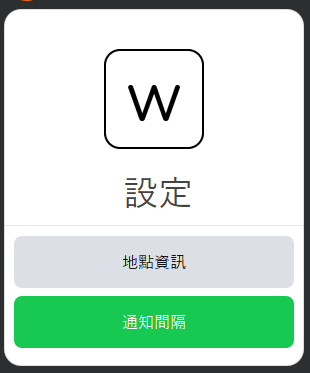
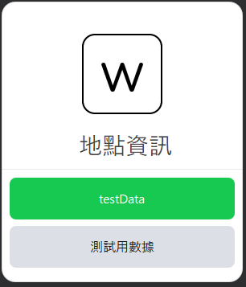
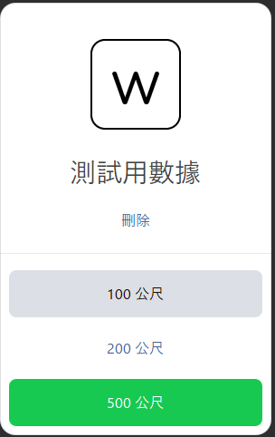
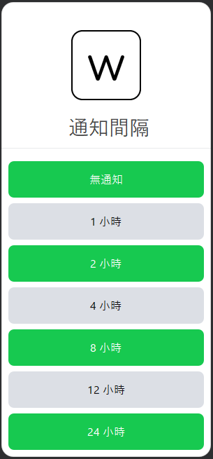
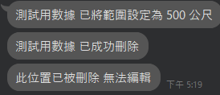
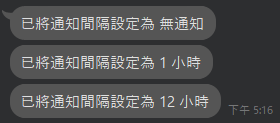

# 智慧型空氣品質監測系統 v2
[English](README.md) | 繁體中文

<a href="https://github.com/wuchieh"></a>
&emsp;
<a href="https://github.com/MeowXiaoXiang"></a>

## 需求
```
PostgreSQL
Redis
go version > 1.20
```

## 介紹
- 此為 `智慧型空氣品質監測系統` 的第二代
- 優化了絕大多數的系統
- 在新版本中 引進了前後端分離 
- 前端使用 Vue3 框架 而非全交由後端渲染 以降低後端壓力
- 並且更換了數據庫 由 MySQL 改成了 [PostgreSQL](https://github.com/lib/pq)
- 以及引入了 [Redis](https://github.com/redis/go-redis/) 以提升部分效率 及適配分布式部屬
- 為了分布式部屬 身分驗證更改為使用 [JWT](https://github.com/golang-jwt/jwt)
- 前後端同時都有使用 i18n(國際化與在地化)
- 畫面呈現上只做了小部分的改動 主要的修改都是為了適配手機端

<hr>

## 前端畫面預覽

&emsp;


## Line畫面預覽

&emsp;



&emsp;



